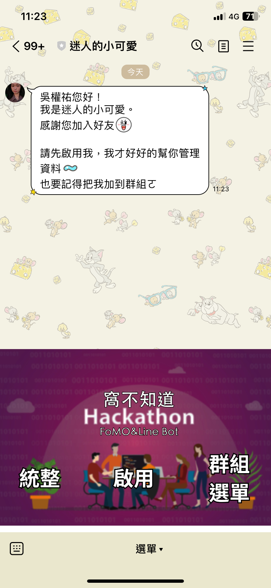
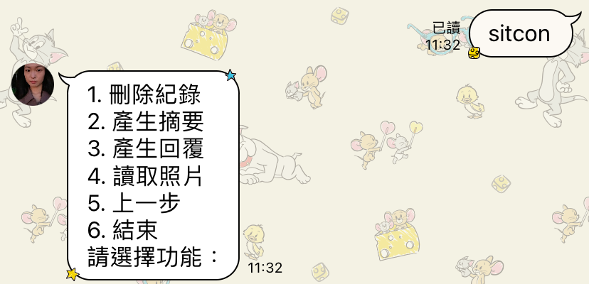
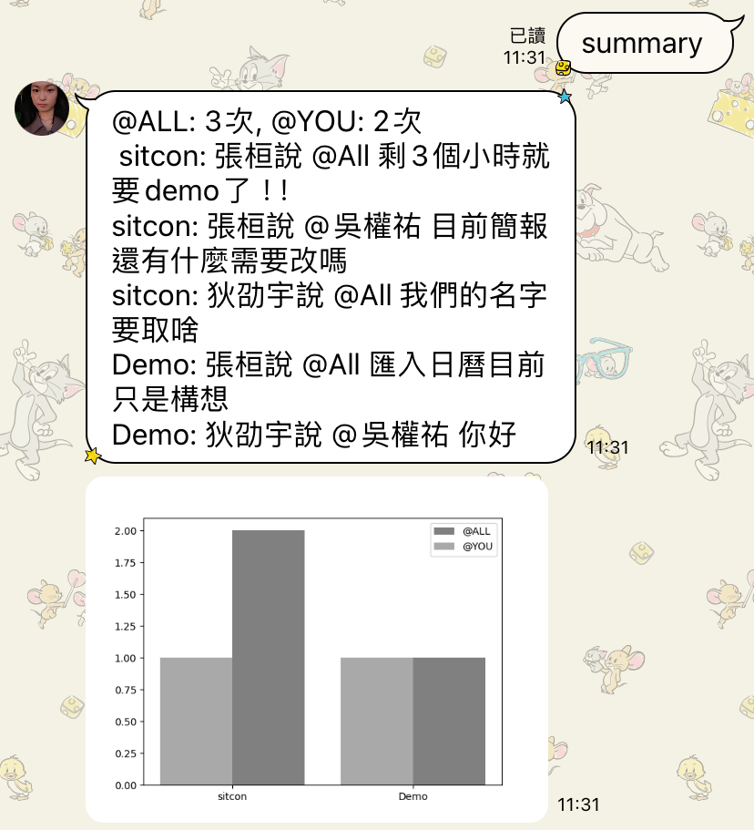
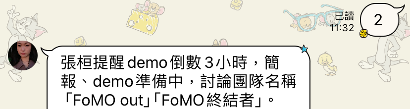
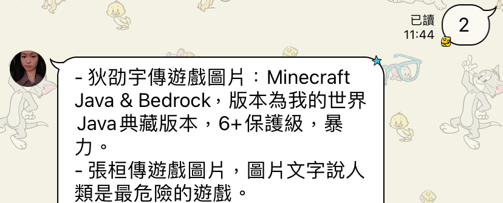

# SITCON Hackthon 2024
## Team Name: 窩不知道

## Introduction

### What is FOMO
FOMO (*Fear of missing out*) is the apprehension that others are enjoying experiences without you, often amplified by social media, leading to a sense of urgency or anxiety to stay connected or participate in activities to avoid feeling left out.

### Why this project
To ensure no important information is missed in communications, we proposed this project to help people quickly access and respond to crucial messages, especially when they are unable to read them in detail.

### Start avoid FOMO
You can enhance your experience by scanning the QR code to add the LineBOT we've created.




## Functions

To use this LineBot, you need to call the group menu first


Then it would show a action menu 


### Quick summarize messages you've been mentioned

### Summarize unread messages

### Quick check unread images

### Fetch information from images

### Help reply to messages


## Features

- **LINE Webhook Handler**: Handles incoming messages from LINE and responds accordingly.
- **Generative AI Integration**: Uses generative AI to process and generate responses based on the content of the messages.
- **Firebase Integration**: Stores and retrieves chat history from Firebase.
- **Google Cloud Storage Integration**: Stores and retrieves image.

## Prerequisites

- Python 3.7+
- LINE Messaging API account
- Generative AI API key 
- Firebase project
- .env file with the following environment variables:
  - `API_ENV`
  - `LINE_CHANNEL_SECRET`
  - `LINE_CHANNEL_ACCESS_TOKEN`
  - `LOG`
  - `FIREBASE_URL`
  - `GEMINI_API_KEY`

## Installation

1. Clone the repository:
    ```bash
    git clone <repository_url>
    cd <repository_directory>
    ```

2. Create and activate a virtual environment:
    ```bash
    python -m venv venv
    source venv/bin/activate  # On Windows use `venv\Scripts\activate`
    ```

3. Install the dependencies:
    ```bash
    pip install -r requirements.txt
    ```

4. Create a `.env` file in the root directory and add the required environment variables.

## Usage

1. Run the FastAPI application:
    ```bash
    uvicorn main:app --host 0.0.0.0 --port 8080 --reload
    ```

2. The application will start and listen for incoming requests on the specified port.

## Endpoints

- **POST /webhooks/line**: Webhook endpoint to handle incoming messages from LINE.

## Environment Variables

- `API_ENV`: Set to `production` or `develop`.
- `LINE_CHANNEL_SECRET`: Your LINE channel secret.
- `LINE_CHANNEL_ACCESS_TOKEN`: Your LINE channel access token.
- `LOG`: Logging level (default is `WARNING`).
- `FIREBASE_URL`: Your Firebase database URL.
- `GEMINI_API_KEY`: Your Gemini AI API key. 

## Logging

The application uses Python's built-in logging module. The log level can be set using the `LOG` environment variable.

## License

This project is licensed under the MIT License.